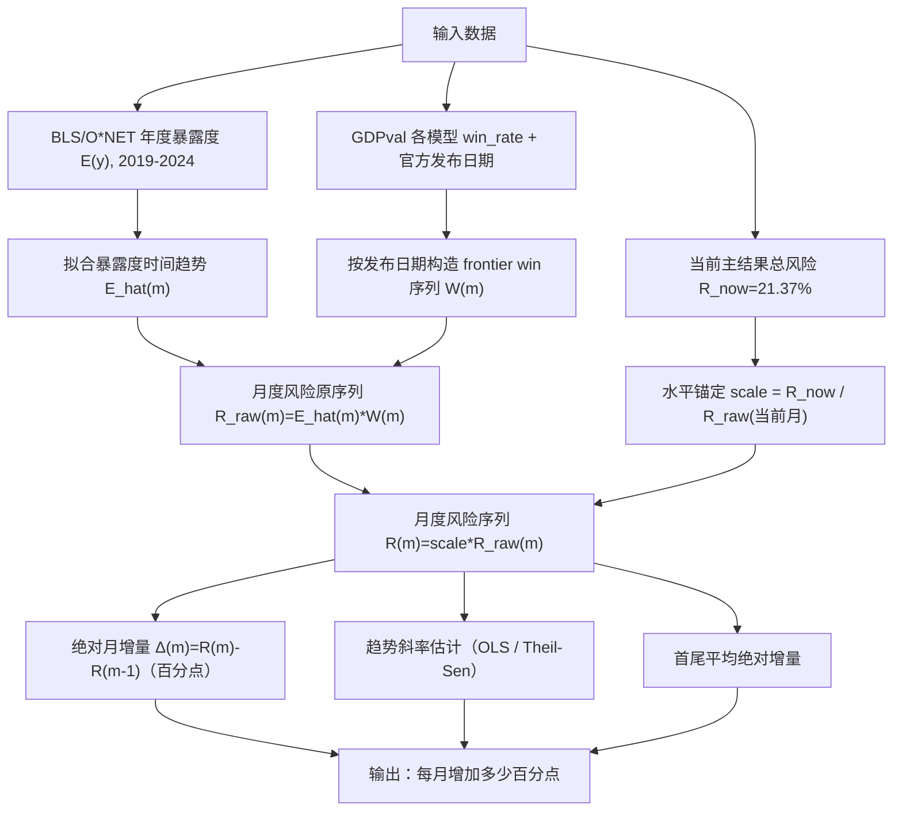

# AI替代风险月度增速估计（任务级对齐口径）

- 口径：`Risk = Exposure × WinRate`（仅 `win_rate`，不计 tie）
- 暴露度时间序列：BLS/O*NET 2019-2024（年度）
- 能力时间序列：GDPval 模型胜率 + 模型发布日期
- 月度序列点数：`20`（2024-05-01 到 2025-12-01，按月）
- 为了和主结果 `21.37%` 对齐，月度风险序列已做水平锚定（不改变增速）。

## 计算框架图

## 核心结论

- 暴露度月增速：`0.0686%`（CAGR），`0.0871%`（log回归）
- WinRate月增速（frontier）：`8.8748%`（CAGR），`8.9055%`（log回归）
- AI替代风险月增速（frontier, 月度序列）：`8.9696%`（CAGR），`11.4147%`（log回归）
- 乘法分解校验：`(1+g_exposure)*(1+g_win)-1 = 8.9495%`（与直接风险CAGR接近）
- 绝对月增量（百分点）：均值 `0.905`，中位数 `0.011`，OLS斜率 `1.033`，Theil-Sen `0.996`
- 水平解读：起点 `4.18%`，上月 `19.53%`，当前 `21.37%`，按CAGR推算下月约 `+1.92` 个百分点

## 暴露度时间序列（全国就业加权）

| 年份 | 全国暴露度 |
|---|---:|
| 2019 | 0.417318 |
| 2020 | 0.412955 |
| 2021 | 0.437197 |
| 2022 | 0.436623 |
| 2023 | 0.435762 |
| 2024 | 0.434858 |

## 能力/风险前沿时间序列（按发布日期）

| 日期 | Frontier WinRate | 暴露度(插值) | Frontier Risk=E×W |
|---|---:|---:|---:|
| 2024-05-13 | 0.098890 | 0.441895 | 0.043699 |
| 2025-03-25 | 0.233333 | 0.445761 | 0.104011 |
| 2025-04-16 | 0.307770 | 0.446149 | 0.137311 |
| 2025-07-09 | 0.307770 | 0.447316 | 0.137671 |
| 2025-08-05 | 0.435860 | 0.447706 | 0.195137 |
| 2025-08-07 | 0.435860 | 0.447706 | 0.195137 |
| 2025-09-29 | 0.435860 | 0.448096 | 0.195307 |
| 2025-11-18 | 0.435860 | 0.448877 | 0.195648 |
| 2025-11-24 | 0.455051 | 0.448877 | 0.204262 |
| 2025-12-11 | 0.497475 | 0.449269 | 0.223500 |

## 风险月度序列（用于绝对增量估计）

| 月份 | Frontier WinRate | 暴露度(插值) | 风险(锚定后) | 单月绝对增量(百分点) |
|---|---:|---:|---:|---:|
| 2024-05-01 | 0.098890 | 0.441895 | 0.041789 |  |
| 2024-06-01 | 0.098890 | 0.442280 | 0.041825 | 0.004 |
| 2024-07-01 | 0.098890 | 0.442665 | 0.041862 | 0.004 |
| 2024-08-01 | 0.098890 | 0.443051 | 0.041898 | 0.004 |
| 2024-09-01 | 0.098890 | 0.443437 | 0.041935 | 0.004 |
| 2024-10-01 | 0.098890 | 0.443824 | 0.041971 | 0.004 |
| 2024-11-01 | 0.098890 | 0.444210 | 0.042008 | 0.004 |
| 2024-12-01 | 0.098890 | 0.444597 | 0.042045 | 0.004 |
| 2025-01-01 | 0.098890 | 0.444985 | 0.042081 | 0.004 |
| 2025-02-01 | 0.098890 | 0.445373 | 0.042118 | 0.004 |
| 2025-03-01 | 0.233333 | 0.445761 | 0.099465 | 5.735 |
| 2025-04-01 | 0.307770 | 0.446149 | 0.131310 | 3.185 |
| 2025-05-01 | 0.307770 | 0.446538 | 0.131424 | 0.011 |
| 2025-06-01 | 0.307770 | 0.446927 | 0.131539 | 0.011 |
| 2025-07-01 | 0.307770 | 0.447316 | 0.131653 | 0.011 |
| 2025-08-01 | 0.435860 | 0.447706 | 0.186608 | 5.495 |
| 2025-09-01 | 0.435860 | 0.448096 | 0.186771 | 0.016 |
| 2025-10-01 | 0.435860 | 0.448487 | 0.186934 | 0.016 |
| 2025-11-01 | 0.455051 | 0.448877 | 0.195334 | 0.840 |
| 2025-12-01 | 0.497475 | 0.449269 | 0.213731 | 1.840 |

## 发布日期映射来源（官方）

| 模型 | 家族 | 发布日 | 来源 | 备注 |
|---|---|---|---|---|
| gpt-4o | GPT-4o | 2024-05-13 | https://openai.com/index/hello-gpt-4o/ | official launch date |
| gemini | Gemini 2.5 Pro | 2025-03-25 | https://blog.google/technology/google-deepmind/gemini-model-thinking-updates-march-2025/ | first public 2.5 Pro release date |
| o3-high | o3 | 2025-04-16 | https://openai.com/index/introducing-o3-and-o4-mini/ | o3 family launch date |
| o3-low | o3 | 2025-04-16 | https://openai.com/index/introducing-o3-and-o4-mini/ | same family/date as o3-high |
| o3-medium | o3 | 2025-04-16 | https://openai.com/index/introducing-o3-and-o4-mini/ | same family/date as o3-high |
| o4-mini-high | o4-mini | 2025-04-16 | https://openai.com/index/introducing-o3-and-o4-mini/ | o4-mini family launch date |
| grok | Grok 4 | 2025-07-09 | https://x.ai/news/grok-4 | announcement date |
| claude | Claude Opus 4.1 | 2025-08-05 | https://docs.anthropic.com/en/release-notes/api | release notes entry date for Opus 4.1 |
| gpt-5-high | GPT-5 | 2025-08-07 | https://openai.com/index/introducing-gpt-5/ | GPT-5 launch date |
| gpt-5-low | GPT-5 | 2025-08-07 | https://openai.com/index/introducing-gpt-5/ | same family/date as gpt-5-high |
| gpt-5-medium | GPT-5 | 2025-08-07 | https://openai.com/index/introducing-gpt-5/ | same family/date as gpt-5-high |
| gpt-5r-high-engprompt | GPT-5 | 2025-08-07 | https://openai.com/index/introducing-gpt-5/ | GDPval prompt/config variant, mapped to GPT-5 family launch date |
| claude-sonnet-45 | Claude Sonnet 4.5 | 2025-09-29 | https://www.anthropic.com/news/claude-sonnet-4-5 | announcement date |
| gemini-3 | Gemini 3 | 2025-11-18 | https://blog.google/technology/google-deepmind/gemini-3/ | Gemini 3 announcement date |
| claude-45 | Claude Opus 4.5 | 2025-11-24 | https://www.anthropic.com/news/claude-opus-4-5 | announcement date |
| gpt-5p2-high | GPT-5.2 | 2025-12-11 | https://openai.com/index/gpt-5-2/ | GPT-5.2 launch date |

## 结果文件

- `output/model_release_timeline_for_growth.csv`
- `output/national_exposure_timeseries_for_growth.csv`
- `output/capability_and_risk_frontier_timeseries.csv`
- `output/risk_frontier_monthly_series.csv`
- `output/monthly_risk_growth_summary.json`
